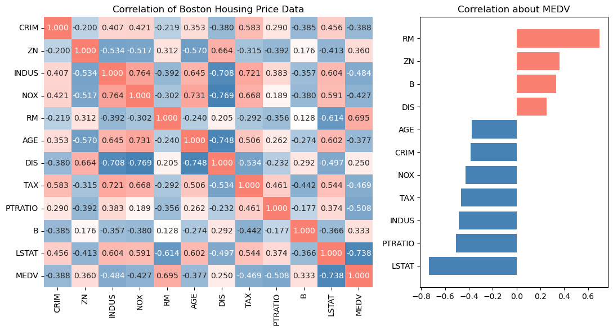
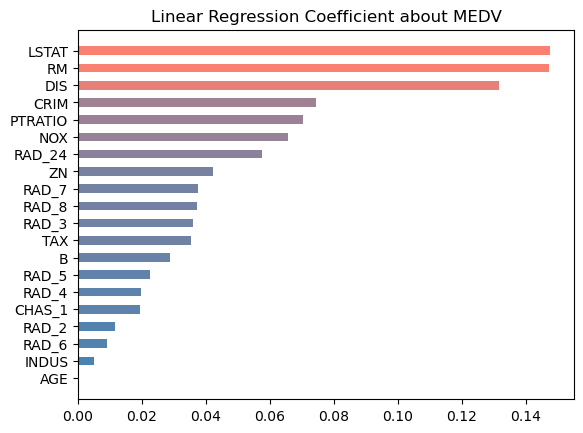
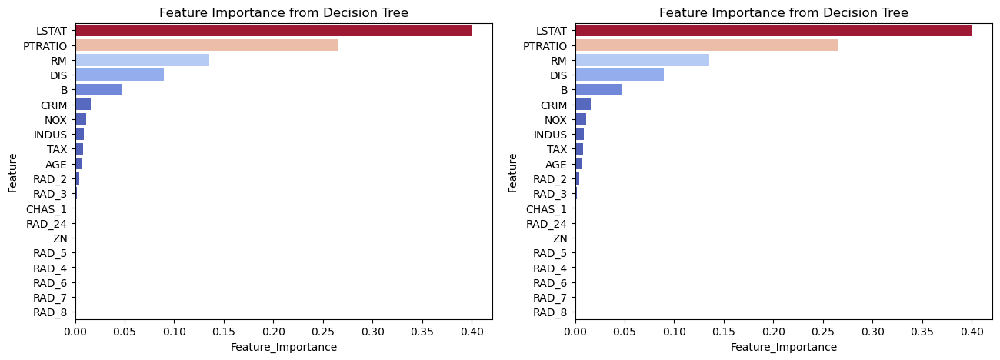
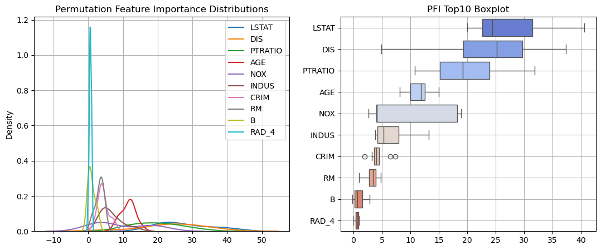
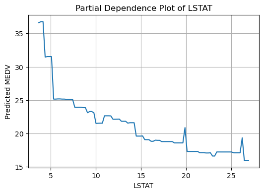
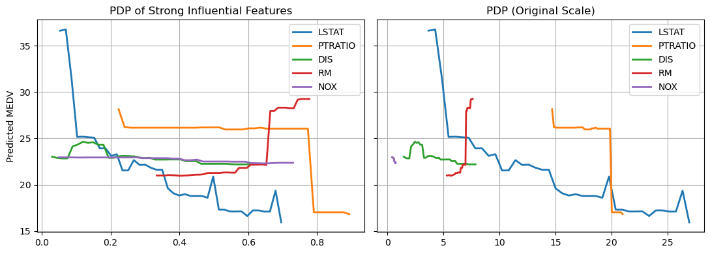

# XAI eXplainable Artificial Intelligence
## 설명 가능한 AI

* 해석 가능성의 측면에서 머신러닝 모델($RF,\,\,SVM,\,\,XGB$ 등)은 회귀 계수를 갖는 선형모형(선형회귀, 로지스틱회귀)에 비해
<br>입력 변수가 예측 결과를 만들어 내는데 어떤 역할을 하는지 이해하기 어렵다.
* 여기서 소개할 다양한 방법을 통해 머신러닝 모델에서 입력 변수들이 어떤 영향력을 갖는지 알 수 있다.
<br><br>
* 다만, XAI 기법은 현상에 대한 모형의 예측을 설명하기 위한 것이지, 현상 자체를 설명하기 위한 것이 아니다.
* 즉, 어디까지나 **_X1이 증가할수록 Y도 증가한다_** 는 **상관 관계**를 나타낼 뿐, 이유를 설명하는 **인과 관계**까지 포함하는 것은 아니다.

---
---

## 1> 변수 중요도 FI

사용한 데이터
```python
from sklearn import datasets
X, Y = datasets.fetch_openml('boston', return_X_y=True, version=1)
```
||CRIM|ZN|INDUS|CHAS|NOX|RM|AGE|DIS|RAD|TAX|PTRATIO|B|LSTAT|MEDV|
|-|-|-|-|-|-|-|-|-|-|-|-|-|-|-|
|0|0.00632|18.0|2.31|0|0.538|6.575|65.2|4.0900|1|296.0|15.3|396.9|4.98|24.0|
|1|0.02731|0.0|7.07|0|0.469|6.421|78.9|4.9671|2|242.0|17.8|396.9|9.14|21.6|

---

### 1-1> 상관계수 Correlation

* 반응 변수에 대해 상관 관계가 클수록 중요한 설명 변수
* 절댓값이 1에 가까울수록 강한 상관 관계가 있고, 0에 가까울수록 상관 관계가 없다. ($\left\vert Cor \right\vert < 1$)
* 종류 : **피어슨(Pearson Cor Coef)** , 스피어만(Spearman Cor Coef), 크론바흐의 알파(Cronbach's Alpha)
<br>

|장점|단점|
|-|-|
|-1에서 +1 사이 값으로 변수 간 관계와 패턴을 직관적으로 확인&nbsp;&nbsp;|선형 관계만 제대로 측정|
|공분산과 달리 변수들의 단위가 달라도 비교 가능|어느 정도가 강한 관계인지 분석 분야나 데이터 특성에 따라 다르게 해석&nbsp;&nbsp;|
|모델의 학습 불필요|범주형 변수로는 부적합|

<center>피어슨 상관계수 (Pearson Correlation Coefficient, PCC)</center>

$$
r_{XY} = {Cov(X,Y) \over \sigma_X\sigma_Y} = {\sum^n_i(X_i - \overline{X})(Y_i - \overline{Y}) \over \sqrt{\sum^n_i(X_i - \overline{X})^2} \sqrt{\sum^n_i(Y_i - \overline{Y})^2}}
$$



그래프 해석
* **LSTAT, RM, PTRATIO, INDUS, ZN** 순으로 강한 상관 관계를 갖는다.

---

### 1-2> 회귀 계수 Linear Regression Coefficient

|장점|단점|
|-|-|
|단순한 선형 회귀 모델로 구현이 쉽고 직관적|단위에 영향을 받으므로 전처리가 필요하고 이상치에 민감&nbsp;&nbsp;|
|설명 변수의 영향력 방향을 명확하게 파악 가능&nbsp;&nbsp;|실제 모형이 비선형인 경우 부적합|

<center>다중 회귀 분석 최소제곱법(Ordinary Least Squares)</center>

$$
\hat{Y} = \beta_0X_0 + \beta_1X_1 + ... + \beta_nX_n + \epsilon
$$
$$
\hat{\beta} = (X^TX)^{-1}X^TY
$$



그래프 해석
* **LSTAT, RM, DIS, CRIM, PTRATIO** 순으로 큰 회귀 계수를 갖는다.

---

### 1-3> 평균 불순도 감소량 Mean Decrease Impurity

* 트리 게열 모델에서 개별 트리의 불순도(Imputirty)의 변화량을 이용해 변수 중요도를 계산
* **불순도 감소량이 큰 변수일수록 중요한 설명 변수**
* Gini Importance(GI) : 불순도 측도가 지니 계수(Gini Index)인 경우 변수 중요도

각 특성 $X$에 대해
$$
Importance(X) = \sum_{t\in{nodes\,where\,X\,used}}\Bigg({N_t \over N} \cdot \Delta{i}(t)\Bigg)
$$

* $t$ : 트리의 노드
* $N_t$ : 노드 $t$에 도달한 샘플 수
* $N$ : 전체 샘플 수 (루트 노드 기준)
* $\Delta{i}(t)$ : 노드 $t$에서 특성 $X$로 분할 시 줄어든 불순도

트리 전체에서 **특정 특성이 분할 기준으로 사용**될 때마다 얼마나 불순도를 줄였는지에 대해 **샘플 수로 가중 평균**하여 계산



그래프 해석
* **LSTAT, TAX, PTRATIO, DIS, NOX** 순으로 불순도가 높다.
* 범주형 변수인 **CHAS**와 **RAD**를 다시 합쳤을 때도 변수 중요도 순위에 큰 변화가 없다.

---

### 1-4> 순열 변수 중요도 Peamutation Feature Importance

* 테스트 데이터 셋의 각 변수를 재배열(Permutation) 한 후의 예측력이 얼마나 변하는지 확인하는 변수 중요도
* 특정 변수를 재배열하더라도 정확도의 변화가 없다면 그 변수는 영향력이 적다.
* 반대로 정확도의 변화가 클수록 변수의 영향력이 크다.



그래프 해석
* X축: 모델 성능 변화량 (MSE 변화)
    - MSE는 낮을 수록 좋은 점수
    - 변수의 PFI 값이 오른쪽으로 갈수록 permute 성능이 더 많이 나빠짐 (더 중요한 feature)
<br><br>
* **LSTAT**은 그래프에서 가장 오른쪽으로 길게 분포한다. 즉, 모델이 LSTAT에 크게 영향을 받는다.
* **DIS**는 그래프에서 두 번째로 큰 값들로 분포한다. 다만, whisker(IQR 이상치 범위)가 길기 때문에 중요도가 불안정하다.
* **AGE**는 KDE 밀도가 낮지만 분포가 좁다. 또한 위에서 4번째이므로 평균적으로 영향력이 있다.

---

### 1-5> 부분 의존도 Partial Dependence

* 설명 변수(특성)이 특정 값으로 변할 때, 모델 예측값의 평균이 어떻게 변하는지를 시각화
* **다른 feature는 고정**하고, 특정 feature 하나만 변화시킬 때 모델의 반응을 관찰



그래프 해석 1
* LSTAT이 낮을수록 예측값(MEDV 주택가격)이 높게 예측
* LSTAT이 커질수록 대체적으로 예측값이 감소
* **4와 6 근처에서 예측값이 급격히 감소**하는 것으로 보아, 모델(Decision Tree)이 해당 값으로 **중요한 분기**를 사용했을 것으로 보임



그래프 해석 2
* **DIS와 NOX**의 PDP 예측값이 23 부근에서 거의 수평선으로 일정하다.
    - 즉, 이전 결과들을 통합한 내용과 달리 영향력이 거의 없다.

* **RM**은 정규화 PDP 그래프에서는 특정 구간에서만 예측값에 영향을 미치는 것으로 보였으나, 실제 데이터의 분포가 좁다.
    - 즉, 약간의 데이터 변화에도 예측값을 민감하게 변화시킬 수 있다.

* **PTRATIO**는 [15, 20) 구간에서는 예측값 변화에 그다지 기여하지 못하지만, 전후로는 크게 변화시킨다.

---
---

## 2> SHAP
