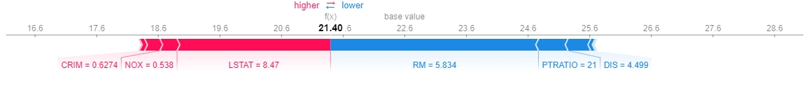

# XAI eXplainable Artificial Intelligence
## 설명 가능한 AI

* 해석 가능성의 측면에서 머신러닝 모델($RF,\,\,SVM,\,\,XGB$ 등)은 회귀 계수를 갖는 선형모형(선형회귀, 로지스틱회귀)에 비해 입력 변수가 예측 결과를 만들어 내는데 어떤 역할을 하는지 이해하기 어렵다.
* 여기서 소개할 다양한 방법을 통해 머신러닝 모델에서 입력 변수들이 어떤 영향력을 갖는지 알 수 있다.
<br><br>
* 다만, XAI 기법은 현상에 대한 모형의 예측을 설명하기 위한 것이지, 현상 자체를 설명하기 위한 것이 아니다.
* 즉, 어디까지나 **_X1이 증가할수록 Y도 증가한다_** 는 **상관 관계**를 나타낼 뿐, 이유를 설명하는 **인과 관계**까지 포함하는 것은 아니다.

## 목차

1. [변수 중요도 Feature Importance](#1-변수-중요도-fi)

    1-1. [상관계수 Correlation](#1-1-상관계수-correlation)

    1-2. [회귀 계수 Linear Regression Coefficient](#1-2-회귀-계수-linear-regression-coefficient)

    1-3. [평균 불순도 감소량 Mean Decrease Impurity](#1-3-평균-불순도-감소량-mean-decrease-impurity)

    1-4. [순열 변수 중요도 Permutation Feature Importance](#1-4-순열-변수-중요도-permutation-feature-importance)

    1-5. [부분 의존도 Partial Dependence](#1-5-부분-의존도-partial-dependence)

2. [SHAP SHapley Additive exPlanations](#2-shap-shapley-additive-explanations)

    2-1. [폭포형 플롯 shap.waterfall_plot](#2-1-폭포형-플롯-shapwaterfall_plot-shapplotswaterfall)

    2-2. [막대 그래프 shap.plots.bar](#2-2-막대-그래프-shapplotsbar)

    2-3. [의존도 플롯 shap.dependence_plot](#2-3-의존도-플롯-shapdependence_plot)

    [&nbsp;&nbsp;&nbsp;&nbsp;&nbsp;&nbsp;&nbsp;교호작용](#교호작용)

    [&nbsp;&nbsp;&nbsp;&nbsp;&nbsp;&nbsp;&nbsp;shap.dependence_plot 에서 자동으로 교호작용 feature 선택하는 방법](#shapdependence_plot-에서-자동으로-교호작용-feature-선택하는-방법)

    [&nbsp;&nbsp;&nbsp;&nbsp;&nbsp;&nbsp;&nbsp;번외)선형모델에서의 교호작용과 비교](#번외-선형모델에서의-교호작용과-비교)

    2-4. [부분 의존도 플롯 shap.partial_dependence_plot](#2-4-부분-의존도-플롯-shappartial_dependence_plot-shapplotspartial_dependence)

    2-5. [요약 플롯 점 그림 shap.summary_plot](#2-5-요약-플롯-점-그림-shapsummary_plotplot_typedot)

    2-6. [힘 플롯 shap.force_plot](#2-6-힘-플롯-shapforce_plot-shapplotsforce)

    [XAI 마무리](#xai-마무리)

3. [인과추론 Causal Inference](#3-인과추론-causal-inference)

---
---

## 1> 변수 중요도 Feature Importance

* 학습된 모형에 대해 **반응 변수(Y)** 와의 관련성 또는 예측 관점에서 **각 설명 변수(X)** 들의 영향력을 수치화한 것

사용한 데이터
```python
from sklearn import datasets
X, Y = datasets.fetch_openml('boston', return_X_y=True, version=1)
# X['CHAS'] = X['CHAS'].astype(int) # SHAP에서는 category/str 불가능
# X['RAD'] = X['RAD'].astype(int) # SHAP에서는 category/str 불가능
```
||CRIM|ZN|INDUS|CHAS|NOX|RM|AGE|DIS|RAD|TAX|PTRATIO|B|LSTAT|MEDV|
|-|-|-|-|-|-|-|-|-|-|-|-|-|-|-|
|0|0.00632|18.0|2.31|0|0.538|6.575|65.2|4.0900|1|296.0|15.3|396.9|4.98|24.0|
|1|0.02731|0.0|7.07|0|0.469|6.421|78.9|4.9671|2|242.0|17.8|396.9|9.14|21.6|

---

### 1-1> 상관계수 Correlation

* 반응 변수에 대해 상관 관계가 클수록 중요한 설명 변수
* 절댓값이 1에 가까울수록 강한 상관 관계가 있고, 0에 가까울수록 상관 관계가 없다. ($\left\vert Cor \right\vert < 1$)
* 종류 : **피어슨(Pearson Cor Coef)** , 스피어만(Spearman Cor Coef), 크론바흐의 알파(Cronbach's Alpha)
<br>

|장점|단점|
|-|-|
|-1에서 +1 사이 값으로 변수 간 관계와 패턴을 직관적으로 확인&nbsp;&nbsp;|선형 관계만 제대로 측정|
|공분산과 달리 변수들의 단위가 달라도 비교 가능|어느 정도가 강한 관계인지 분석 분야나 데이터 특성에 따라 다르게 해석&nbsp;&nbsp;|
|모델의 학습 불필요|범주형 변수로는 부적합|

<center>피어슨 상관계수 (Pearson Correlation Coefficient, PCC)</center>

$$
r_{XY} = {Cov(X,Y) \over \sigma_X\sigma_Y} = {\sum^n_i(X_i - \overline{X})(Y_i - \overline{Y}) \over \sqrt{\sum^n_i(X_i - \overline{X})^2} \sqrt{\sum^n_i(Y_i - \overline{Y})^2}}
$$


그래프 해석
* **LSTAT, RM, PTRATIO, INDUS, ZN** 순으로 강한 상관 관계를 갖는다.

<p align="right">
    <a href=#xai-explainable-artificial-intelligence>
        <strong>Top 🔝</strong>
    </a>
</p>

---

### 1-2> 회귀 계수 Linear Regression Coefficient

|장점|단점|
|-|-|
|단순한 선형 회귀 모델로 구현이 쉽고 직관적|단위에 영향을 받으므로 전처리가 필요하고 이상치에 민감&nbsp;&nbsp;|
|설명 변수의 영향력 방향을 명확하게 파악 가능&nbsp;&nbsp;|실제 모형이 비선형인 경우 부적합|

<center>다중 회귀 분석 최소제곱법(Ordinary Least Squares)</center>

$$
\hat{Y} = \beta_0X_0 + \beta_1X_1 + ... + \beta_nX_n + \epsilon
$$
$$
\hat{\beta} = (X^TX)^{-1}X^TY
$$


그래프 해석
* **LSTAT, RM, DIS, CRIM, PTRATIO** 순으로 큰 회귀 계수를 갖는다.

<p align="right">
    <a href=#xai-explainable-artificial-intelligence>
        <strong>Top 🔝</strong>
    </a>
</p>

---

### 1-3> 평균 불순도 감소량 Mean Decrease Impurity

* 트리 게열 모델에서 개별 트리의 불순도(Imputirty)의 변화량을 이용해 변수 중요도를 계산
* **불순도 감소량이 큰 변수일수록 중요한 설명 변수**
* Gini Importance(GI) : 불순도 측도가 지니 계수(Gini Index)인 경우 변수 중요도

각 특성 $X$에 대해
$$
Importance(X) = \sum_{t\in{nodes\,where\,X\,used}}\Bigg({N_t \over N} \cdot \Delta{i}(t)\Bigg)
$$

* $t$ : 트리의 노드
* $N_t$ : 노드 $t$에 도달한 샘플 수
* $N$ : 전체 샘플 수 (루트 노드 기준)
* $\Delta{i}(t)$ : 노드 $t$에서 특성 $X$로 분할 시 줄어든 불순도

트리 전체에서 **특정 특성이 분할 기준으로 사용**될 때마다 얼마나 불순도를 줄였는지에 대해 **샘플 수로 가중 평균**하여 계산


그래프 해석
* **LSTAT, TAX, PTRATIO, DIS, NOX** 순으로 불순도가 높다.
* 범주형 변수인 **CHAS**와 **RAD**를 다시 합쳤을 때도 변수 중요도 순위에 큰 변화가 없다.

<p align="right">
    <a href=#xai-explainable-artificial-intelligence>
        <strong>Top 🔝</strong>
    </a>
</p>

---

### 1-4> 순열 변수 중요도 Permutation Feature Importance

* 테스트 데이터 셋의 각 변수를 재배열(Permutation) 한 후의 예측력이 얼마나 변하는지 확인하는 변수 중요도
* 특정 변수를 재배열하더라도 정확도의 변화가 없다면 그 변수는 영향력이 적다.
* 반대로 정확도의 변화가 클수록 변수의 영향력이 크다.


그래프 해석
* X축: 모델 성능 변화량 (MSE 변화)
    - MSE는 낮을 수록 좋은 점수
    - 변수의 PFI 값이 오른쪽으로 갈수록 permute 성능이 더 많이 나빠짐 (더 중요한 feature)
<br><br>
* **LSTAT**은 그래프에서 가장 오른쪽으로 길게 분포한다. 즉, 모델이 LSTAT에 크게 영향을 받는다.
* **DIS**는 그래프에서 두 번째로 큰 값들로 분포한다. 다만, whisker(IQR 이상치 범위)가 길기 때문에 중요도가 불안정하다.
* **AGE**는 KDE 밀도가 낮지만 분포가 좁다. 또한 위에서 4번째이므로 평균적으로 영향력이 있다.

<p align="right">
    <a href=#xai-explainable-artificial-intelligence>
        <strong>Top 🔝</strong>
    </a>
</p>

---

### 1-5> 부분 의존도 Partial Dependence

* 설명 변수(특성)이 특정 값으로 변할 때, 모델 예측값의 평균이 어떻게 변하는지를 시각화
* **다른 feature는 고정**하고, 특정 feature 하나만 변화시킬 때 모델의 반응을 관찰


그래프 해석 1
* LSTAT이 낮을수록 예측값(MEDV 주택가격)이 높게 예측
* LSTAT이 커질수록 대체적으로 예측값이 감소
* **4와 6 근처에서 예측값이 급격히 감소**하는 것으로 보아, 모델(Decision Tree)이 해당 값으로 **중요한 분기**를 사용했을 것으로 보임


그래프 해석 2
* **DIS와 NOX**의 PDP 예측값이 23 부근에서 거의 수평선으로 일정하다.
    - 즉, 이전 결과들을 통합한 내용과 달리 영향력이 거의 없다.

* **RM**은 정규화 PDP 그래프에서는 특정 구간에서만 예측값에 영향을 미치는 것으로 보였으나, 실제 데이터의 분포가 좁다.
    - 즉, 약간의 데이터 변화에도 예측값을 민감하게 변화시킬 수 있다.

* **PTRATIO**는 [15, 20) 구간에서는 예측값 변화에 그다지 기여하지 못하지만, 전후로는 크게 변화시킨다.

<p align="right">
    <a href=#xai-explainable-artificial-intelligence>
        <strong>Top 🔝</strong>
    </a>
</p>

---
---

## 2> SHAP SHapley Additive exPlanations

* Shapley value와 feature간 독립성을 기초로 머신 러닝 모델의 예측을 설명하는 설명 모델
    - **Shapley Value** : 게임 이론에서 게임 참여자가 협력하여 얻은 이익을 각각에게 공평하게 분배하는 방법을 위한 개념

* feature가 독립적이라는 가정하에, **모델의 예측에 각 feature가 얼마나 기여**하는지를 **feature가 제거되었을 때와 포함되었을 때**의 차이로 계산

<center>Shapley value</center>

$$
\phi_i = \displaystyle\sum_{S \subseteq F/\{i\}} {|S|!\,(|F| - |S| - 1)! \over |F|!} (f(S \cup \{i\}) - f(S))
$$
<center>가중치 X 관심 변수 제외시 기여도</center>

* $\phi_i$ : 특정 변수의 Shapley value
* $S$ : 관심 변수가 제외된 변수 부분집합 ($|S|$ : 집합의 크기)
* $i$ : 관심 있는 변수 집합
* $F$ : 전체 변수의 부분 집합

<!-- [공식문서 shap.readthedocs.io](){:target="_blank"} -->
<a herf="https://shap.readthedocs.io/en/latest/example_notebooks/overviews/An%20introduction%20to%20explainable%20AI%20with%20Shapley%20values.html" target="_blank">공식문서 shap.readthedocs.io</a>

``` python
model_rf = RandomForestRegressor(max_depth=5, n_estimators=20, random_state=42)
model_rf.fit(X, Y.values.ravel())
explainer_rf = shap.TreeExplainer(model_rf) # 만약 model_rf.predict 이면 모델을 블랙박스로 간주하고 샘플링 기반 shap 사용
shap_values_rf = explainer_rf(X) # X 모든 데이터에 대해 shap 값 계산
sample_id = 15 # 임의로 15번째 데이터를 SHAP 시각화
```
<p align="right">
    <a href=#xai-explainable-artificial-intelligence>
        <strong>Top 🔝</strong>
    </a>
</p>

---

### 2-1> 폭포형 플롯 shap.waterfall_plot (shap.plots.waterfall)

* 단일 예측에 대한 설명


그래프 해석

* 전체 데이터에 대한 평균 예측값:  22.6023
* 학습된 RF모델이 15번 형태의 입력을 받았을 때 예측할 값:  21.4027

<center>

|특성|데이터값|예측값에 대한 shap 기여도|
|:-|-:|-:|
|RM|5.834|-3.374|
|LSTAT|8.470|+2.491|
|PTRATIO|21.000|-0.478|
|DIS|4.499|-0.368|
</center>

<p align="right">
    <a href=#xai-explainable-artificial-intelligence>
        <strong>Top 🔝</strong>
    </a>
</p>

---

### 2-2> 막대 그래프 shap.plots.bar

* 각 특성의 영향력의 절댓값 평균


그래프 해석

```python
np.abs(shap_values_rf.values[:, 12]).sum() / len(X) # LSTAT, np.float64(3.7507)
```

<p align="right">
    <a href=#xai-explainable-artificial-intelligence>
        <strong>Top 🔝</strong>
    </a>
</p>

---

### 2-3> 의존도 플롯 shap.dependence_plot

* 특정 변수와 가장 교호작용 효과가 큰 변수 확인

#### 교호작용

* 한 요인의 효과가 다른 요인의 수준에 따라 달라지는 현상
* ex) 운동량이 건강에 좋은 영향이 있지만, 나이에 따라 그 효과가 달라지는 경우 -> 운동량 X 나이 교호작용
<br>

<center>

||<center>상관관계</center>|<center>교호작용</center>|
|-|-|-|
|정의|두 변수 간 선형적 관계&nbsp;&nbsp;|두 변수가 함께 결과에 영향을 주는 방식의 변화&nbsp;|
|수치 표현|상관계수(Pearson 등)|회귀계수, 시각화|
</center>

#### shap.dependence_plot 에서 자동으로 교호작용 feature 선택하는 방법

```python
interaction_index = approximate_interactions(main_feature_index, shap_values, X)[0]
# main_feature_index=LSTAT -> return 7 (DIS)
```
* 이때 approximate_interactions (list) 는 다음과 같이 계산

1. ```main_feature_index``` 기준으로 데이터와 SHAP 값 정렬
2. 전체 데이터를 최대 50개씩 분할 ```max(min(int(len(X) / 10.0), 50), 1)```
3. 분할된 구간별로 ```abs(corrcoef)``` 계산, 결측치도 포함
4. 모든 feature에 대해 결과값이 가장 큰(상호작용이 강한) feature 선택

<!-- [github.com/shap/shap/blob/master/shap/utils/_general.py](https://github.com/shap/shap/blob/master/shap/utils/_general.py#L109) -->

<a herf="https://github.com/shap/shap/blob/master/shap/utils/_general.py#L109" target="_blank">github.com/shap/shap/blob/master/shap/utils/_general.py</a>


그래프 해석

* **SHAP value for LSTAT=0** 기준으로, 대략 **LSTAT<=10** 일때 예측값을 증가시키는 방향으로 영향을 미치고 있다.
* 또한 **LSTAT>10** 일 때, 대체로 **DIS**값이 작으며(파란색) 예측값을 감소시키므로 **LSTAT 변수와 DIS 변수 간 교호작용이 있다.**

#### 번외) 선형모델에서의 교호작용과 비교

* 선형모델에서는 LSTAT~DIS 관계가 -0.0207, p=0.342 로 유의하지 않다고 판단함.
* 다만, SHAP에서는 비선형모델(랜덤포레스트)을 사용했기 때문에 당연히 LSTAT과 DIST의 교호작용에 대한 결과가 다름.

```python
import statsmodels.api as sm

tempdf = df1.copy()
tempdf['X1_X2'] = tempdf['LSTAT'] * tempdf['DIS']
tempx = sm.add_constant(tempdf.drop('MEDV', axis=1))
tempy = tempdf['MEDV']
m2 = sm.OLS(tempy, tempx).fit()

print(m2.summary())

                 coef    std err          t      P>|t|      [0.025      0.975]
------------------------------------------------------------------------------
const         36.7250      5.112      7.185      0.000      26.682      46.768
                                    --- 중략 --- 
DIS           -1.2525      0.308     -4.071      0.000      -1.857      -0.648
LSTAT         -0.4720      0.075     -6.281      0.000      -0.620      -0.324
X1_X2         -0.0207      0.022     -0.952      0.342      -0.063       0.022
```

<p align="right">
    <a href=#xai-explainable-artificial-intelligence>
        <strong>Top 🔝</strong>
    </a>
</p>

---

### 2-4> 부분 의존도 플롯 shap.partial_dependence_plot (shap.plots.partial_dependence)

* 특정 특성이 변화했을때 모델의 출력에 어떤 영향을 미치고, 그 특성 값의 분포는 어떻게 되는지


그래프 해석

* **수평점선 E[f(x) | LSTAT] = E[f(x)]** : 다른 feature는 고정하고 LSTAT값을 x축값들로 변화시킬 때 모델의 예측값의 평균
```python
model_rf.predict(X).mean() # 22.5131
```
* **수직점선 LSTAT = E[LSTAT]** : X에서 LSTAT의 평균
```python
X['LSTAT'].mean() # 12.6530
```
* **빨간선** : 15번 데이터에서, 예측값의 평균에서 영향을 준 LSTAT의 shap value
```python
shap_values_rf[15, X.columns.get_loc('LSTAT')].values # 2.4905
```
* **검은점** : 모델의 예측값
```python
model_rf.predict(X).mean() + shap_values_rf[15, X.columns.get_loc('LSTAT')].values # 25.0037
```
* **파란선** : LSTAT 값의 변화에 따른 모델 예측값의 평균의 변화

<p align="right">
    <a href=#xai-explainable-artificial-intelligence>
        <strong>Top 🔝</strong>
    </a>
</p>

---

### 2-5> 요약 플롯 점 그림 shap.summary_plot(plot_type='dot')


그래프 해석

* 빨간색일때 특징이 큰 값, 파란색일때 특징이 작은 값
* 특징이 어떤 값일때 0을 기준으로 어느 방향으로 얼마나 영향을 미치는지 확인
<br><br>
* **LSTAT**은 **큰 값**일수록 **예측값을 크게 감소**시키고, 작은 값일수록 예측값을 크게 증가시킨다. (음의 상관성)
* **RM**은 **작은 값**일수록 **예측값을 약간 감소**시키고, 큰 값일수록 예측값을 크게 증가시킨다. (양의 상관성)

<p align="right">
    <a href=#xai-explainable-artificial-intelligence>
        <strong>Top 🔝</strong>
    </a>
</p>

---

### 2-6> 힘 플롯 shap.force_plot (shap.plots.force)

* 특정 데이터 하나, 또는 전체 데이터에 대한 SHAP 값 확인




<!-- [👉 View Force Plot](https://cosmos17.github.io/xai/force_plot2.html) -->
<a href="https://cosmos17.github.io/xai/force_plot2.html" target="_blank">👉 View Force Plot</a>


<p align="right">
    <a href=#xai-explainable-artificial-intelligence>
        <strong>Top 🔝</strong>
    </a>
</p>

### XAI 마무리

* SHAP 를 통해 FI 보다 더 나아가서 **변수들이 예측값에 대해 어느 정도의 영향력을 미치는지 정확하게 값으로 확인**할 수 있다.

---
---

## 3> 인과추론 Causal Inference

<p align="right">
    <a href=#xai-explainable-artificial-intelligence>
        <strong>Top 🔝</strong>
    </a>
</p>
